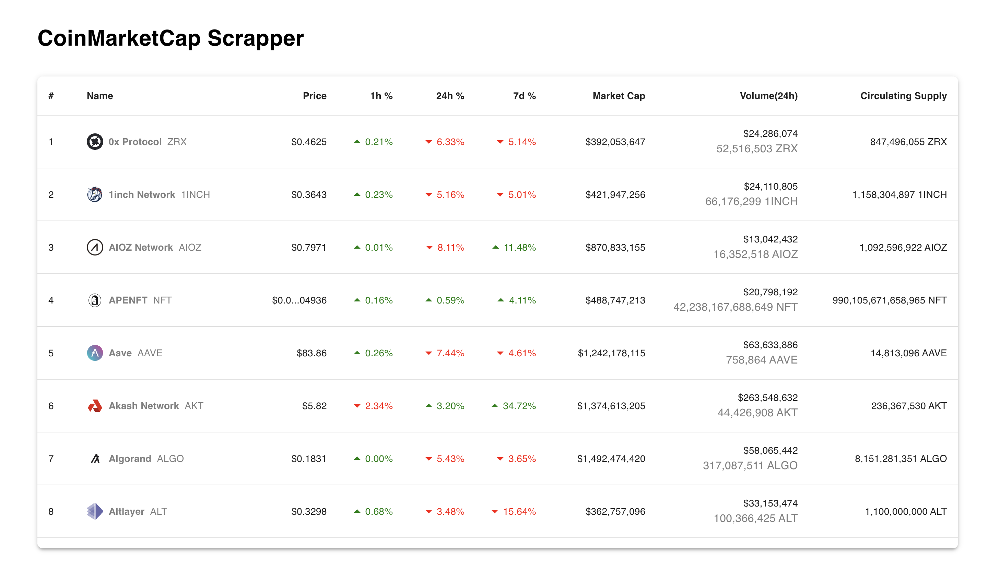

# CoinMarketCap Scraper
A web scraper application that scrapes data from CoinMarketCap at regular intervals, sends POST requests to a backend API, and stores the data in a database.

The frontend component continuously polls the backend for updated data and displays it in an infinitely scrolled table.

# Scraper Recording
https://drive.google.com/file/d/1R-vEw7R1ZLr9W0D1g2-rcSfJFg3UOOWB/view?usp=sharing

# Website Recording
https://drive.google.com/file/d/1MFgVW8JNqv1v2mVPedlW16I9-Cany8T9/view?usp=sharing

## To run the project on Local machine:

- Please install nvm on your system before running this project
- Node version : v18.19.0
- Npm version : v10.2.3

### Base setup

`nvm use` or `nvm use v18.19.0`

`npm install` or `npm i`

### For local development

`npm run dev`

### For production build
 
`npm run build`
